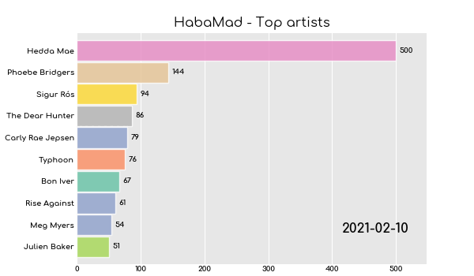
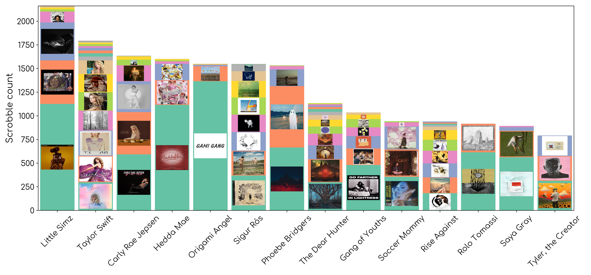
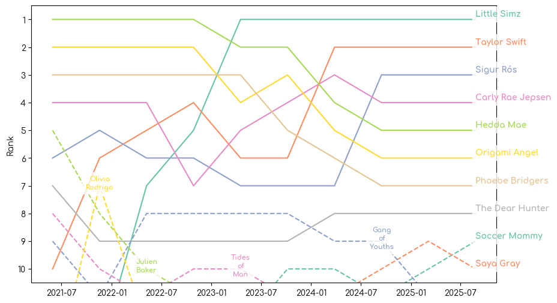
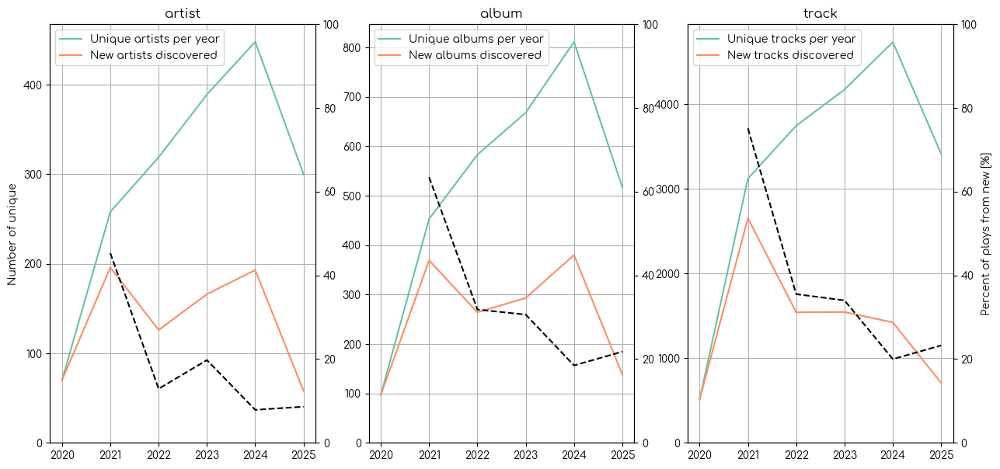
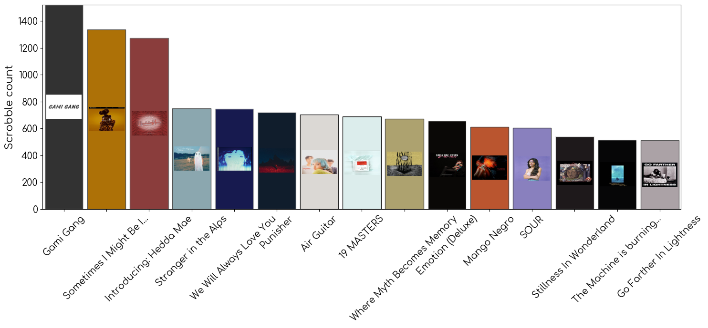

## LastCharts

Python package to plot charts from a user's LastFM data. LastCharts downloads a users entire listing history using the [LastFM Rest API](https://www.last.fm/api/rest), and includes methods to create pre-defined charts. 



## Pre-requisites

- [Python](https://www.python.org/). not sure what is minimum version required. I have used 3.12. 
- To generate bar chart races you need at least one of:
    - [FFmpeg](https://ffmpeg.org/) for exporting video formats like mp4
    - [ImageMagick](https://imagemagick.org/index.php) for exporting gifs
- A [LastFM API account](https://www.last.fm/api/account/create), it is very easy to setup. See your existing LastFM API accounts [here](https://www.last.fm/api/accounts).

## Get started

### Clone the repo

```
https://github.com/Habarug/LastCharts.git
cd LastCharts
```

### Install lastcharts
```
pip install .
```

### Import package and instantiate LastCharts
In Jupyter/python shell:
```python
import lastcharts

lc = lastcharts.LastCharts(YOUR API KEY, YOUR USERNAME)
```

### Load scrobbles for a user

```python
lc.load_scrobbles(user = ENTER USERNAME)
```
- If no username is provided it will use your username. 
- Go grab a snack. The first time you run this for a user it may run for a very long time, depending on how long the users history is. You can only load 200 scrobbles at a time from LastFM, and the API is heavily rate limited. The next time you run this command only new scrobbles will be downloaded, and it will be much faster. 

### Plot stacked bar plot
Once the scrobbles are loaded you can start plotting. The first time you plot a stacked bar plot album covers are downloaded to your computer, so it may take a little while to run the first time. 

```python
fig, ax = lc.stacked_bar_plot(
    startDate           = None, # Optional start date for plot, format ISO 8601 (YYYY-MM-DD)
    endDate             = None, # Optional end date for plot, format ISO 8601 (YYYY-MM-DD)
    nArtists            = 15,   # Change how many artists are included
    artLimitCoefficient = 0.05  # Cofficient to determine which albums will include cover art. 
                                # 0.05 => only albums with at least 5% of the highest bar will get a cover art
)
```


### Plot bar chart race
This is very cool, but quite slow and memory intensive, so you may have to tweak the parameters a bit to get the results you want. The dates are filtered before plotting if the history is long, as it otherwise made me run out of memory. Adjust length, f_period and **{steps_per_period} to find your ideal tradeoff between length, smoothness and performance. For more information on ```**bcr_options``` check the [bar_chart_race documentation](https://github.com/dexplo/bar_chart_race).

```python
lc.bar_chart_race(
    column              = "artist", # Can select artist, album or track
    startDate           = None,     # Optional start date for plot, format ISO 8601 (YYYY-MM-DD)
    endDate             = None,     # Optional end date for plot, format ISO 8601 (YYYY-MM-DD)
    length              = 10,       # Length of the resulting video in seconds
    f_periods           = 15,       # Number of dates to plot per second
    format              = "gif",    # Format to save, gif, mp4,...
    skip_empty_dates    = False,    # Option to skip dates with no scrobbles           
    **{"steps_per_period" : 4,      # Number of frames per period
    "fig_kwargs": {                 # kwargs for fig
        "dpi": 100},                # dpi of images
    }  # Custom arguments for the bar_chart_race. More available
)
```


### Plot rank timeline (what is a better name for this?)
Similar information to the bar chart race, but in image form! Not as exciting, but honestly this is more informative.

```python
fig, ax = lc.plot_rank_timeline(
    column="artist",    # Can select artist, album or track
    nTimesteps=10,      # Number of timesteps to use (often looks messy with too many)
    nPlot=10,           # Number of e.g. artists to show at once.
    nInclude=200,       # Number of your top e.g. artists to include in the analysis
    startDate=None,     # Optional start date for plot, format ISO 8601 (YYYY-MM-DD)
    endDate=None,       # Optional end date for plot, format ISO 8601 (YYYY-MM-DD)
)
```




### Plot yearly discoveries/unqiue artists/albums/tracks
Presents how many unique artists/albums/tracks you have listened to each year, as well as how many new were discovered and what fraction of scrobbles were from new discoveries.

```python
fig, ax = lc.plot_yearly_discoveries()
```



### Plot top artists/album/tracks
Bar plot of top artists, album or tracks, with optional time filtering.

```python
lc.plot_top(
    column      = "album", # Artist, album or track
    nBars       = 15,       # Number of bars to plot
    startDate   = None,     # Optional start date for plot, format ISO 8601 (YYYY-MM-DD)
    endDate     = None      # Optional end date for plot, format ISO 8601 (YYYY-MM-DD)
)
```



### Get number of scrobbles for a given query

Simple method for getting the exact number of scrobbles an artist/album/track, optionally for a specific timeframe. Note: Doesn't actually work particularly well for tracks, and potentially albums, because it won't differentiate between tracks by different artists with the same name.

```
lc.get_scrobbles_for(
    query = "Carry On",
    column = "track",
    startDate = None,
    endDate = None
)

Number of scrobbles for Grace Kelly: 14
```
